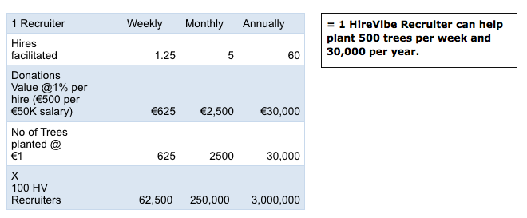
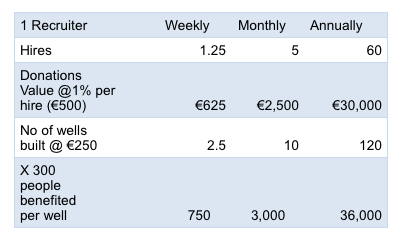

# HIREVIBES WHITEPAPER

**Version:** 1.3

## Mission 
HireVibes leverages the power of crowdsourcing to help people find great jobs and companies build great teams; and give back to the global community.

## Vision
Our vision is to be the platform for all industries to connect any type of talent with any type of project and pay in cryptocurrency.

1. [About HireVibes](#01-about-hirevibes)
    * Mission
    * Vision
    * Overview
    * How is HireVibes different than other job search platforms?
2. [Market Opportunity](#02-market-opportunity)
    * What is the market opportunity/growth potential?
3. [Target Audiences](#03-target-audiences)
    * Employers
    * Jobseekers
    * Recruiters
    * Use Case
4. [Service Fee and Bonus Terms](#04-service-fee-and-bonus-terms)
    * Permanent and Contract Job Terms
    * Freelance Job Terms
    * Token Reward Bonus
5. [Growth](#05-growth)
    * Recruitment Team
    * Marketing Strategy
6. [Product Roadmap](#06-product-roadmap)
    * Product Roadmap
    * Launch Schedule
7. [Governance](#07-governance)
    * What is a DAC?
    * The HireVibes Constitution and HireVibes DAC
    * What is the HireVibes governance structure?
    * What is the difference between the HireVibes DAC and HireVibes Foundation?
    * What power does the DAC have?
    * What are the responsibilities of the HireVibes Foundation?
8. [Token Supply and Distribution](#8-token-supply-and-distribution)
    * What is the token supply?
    * How are tokens allocated?
    * How are HireVibes Tokens (HVT) used?
    * How does the daily token reward work?
    * When is the HireVibes Airdrop happening? How are tokens distributed?
    * How is the launch team rewarded with HVT?

9. [Giving Back](#9-giving-back)
    * What charities does HireVibes partner with? How are new charities selected?
    * Donation Tracking
    * Positive Impact Projections

10. [Contact Us](#10-contact-us)

## 01. About HireVibes
**Overview**

HireVibes connects jobseekers, employers, referrers and recruiters on a new job search platform (Dapp) based on the EOS blockchain. We aim to improve the hiring process by leveraging peer referrals to fill open positions, creating a fair incentive model with reasonable recruiter fees, and giving to a worthy cause everytime a role is filled through HireVibes.

HireVibes is a marketplace that will empower --

People to: 
  * Find jobs with the help of peers via targeted and private referrals
  * Get paid in cryptocurrency (and fiat tbc)
  * Earn more with a 3.5% bonus in HireVibes Tokens (HVT) on top of pay (split if referred to the role)
  * Give back - A donation amount equivalent to 1% of the annual rate or salary will by securely donated to a humanitarian and environmental initiative of the hired candidate’s choice

Individuals, teams, startups, businesses, non-profits and other DACs to:

  * Hire qualified candidates based on peer referrals
  * Work with a dedicated recruiter to facilitate the hiring process for a small extra fee
  * Pay in cryptocurrency (and fiat tbc)
  * Reduce hiring costs - the HireVibes Dapp costs less than half the average price of a centralized recruitment agency
  * Give back to a good cause with every hire

**How is HireVibes different than other job search platforms?**

HireVibes is empowering a world that values people over profits. We are the antithesis of the current, pervasive model of wealth accumulating at the top. We believe that all people are equal and have a right to the pursuit of happiness. That is why the HireVibes platform is built to help you find the right job or hire the right person, but also to help each other. Help friends and colleagues in their job search with a peer referral and giveback to the global community - a donation is made to a great cause everytime someone is hired through the HireVibes platform.

HireVibes also is built on blockchain and is leveraging the benefits of security and operational efficiency possible with a decentralized, community-governed application. Each individual will also have control over their personal data.

## 02. Market Opportunity
**What is the market opportunity/growth potential?**

HireVibes is improving the global staffing industry with crowdsourcing and blockchain technology. Our initial focus is on jobseekers and hirers in the IT space as early adopters need less onboarding. In 2016, the global staffing market generated $428 billion USD of revenue with growth of 5% expected in 2018 (staffingindustry.com). After proving the model and technology, we will expand into other markets.

## 03. Target Audiences
HireVibes aspires to be a platform utilized across all industries and will pursue any viable opportunity as the platform evolves. Strategically, the EOS and overall IT audiences will be targeted as a lead sector to engage with as it is a natural early adopter of the solution.

**Employers**

HireVibes Dapp will be a single place where a hirer can advertise for free, find qualified candidates, manage CV applications, communicate in-app, and hire and pay securely; consistently make the right hires in an efficient, brand-empowering and cost-effective way. 

The cost of using HireVibes is half the cost compared to the 20% industry average fee on permanent jobs, and much less than half of the 25% - 30% average fee charged by centralized agencies on contract jobs.

  * Post jobs for free
  * Pay 5.5% (up to max 10%) only when a position is filled
  * Find qualified candidates based on peer referrals
  * Pay in cryptocurrency or fiat currency
 
**Jobseekers**

By involving peer referrals and crowdsourcing in the hiring process, jobseekers are more likely to find a great fit with the right employer and the right role - this leads to greater job satisfaction and retention for the employer. Additionally, the jobseeker receives a bonus by using the HireVibes platform.

  * Earn a 3.5% token reward when hired through the platform; if referred to the role, the reward is split with the referrer
  * When hired, earn a 1% donation reward to contribute to the charity of your choice
  * Get paid in cryptocurrency or fiat

**Recruiters**

The platform encourages recruiters to build their business connecting hirers and jobseekers. In addition, HireVibes Foundation will partner with a Services Company that will grow a professional Recruitment Consulting team (details below) to drive new clients to the HireVibes application.

**Use Case**

When it comes to sourcing technical IT talent, for example, other technical talent themselves are the best people to find top-qualified peers because they are the domain experts in this field - they know the job spec and required profile. By utilizing peer-referrals, employers will gain access to a wider network of domain experts to source the talent they are looking for. The referrers are rewarded for any candidate they recommend who is successfully hired.

## 04. Service Fee and Bonus Terms
Below are the details on the terms for the 5.5% service fee for hirers and the bonus for new employees for permanent, contract and freelance jobs. Permanent and contract jobs are considered those that last longer than three months; freelance projects have a duration of less than three months. Freelance hires can be paid an hourly rate or an agreed on fixed rate for a project.

**Permanent and Contract Job Terms**

First 30 Days

* Employers will receive an invoice on the new hire start date; the 5.5% fee is required to be paid within 30 days
  * If a hired candidate accepts and starts a job but leaves within the first 30 days, the employer or candidate must contact HireVibes customer support and the invoice will be cancelled
    * If a hired candidate accepts and starts a job but leaves between 30 and 60 days, the remaining 50% to be paid to candidate will be refunded to the employer
    * If a hired candidate accepts and starts a job but leaves between 60 and 90 days, the remaining 25% to be paid to the candidate will be refunded to the employer
  * New hires will receive a 1.75% token reward (50% of the total token reward) after they complete their first 30 days (dependent on receipt of employer fee)
    * If a referrer was involved in the hiring process, the 1.75% token reward will be split and paid at this time

Days 30 - 60

* The next bonus reward will be paid to the new hire when they complete 60 days of employment; this will be a 1% token reward (25% of the total token reward)
  * If a referrer was involved in the hiring process, the 1% token reward will be split and paid at this time

Days 60 - 90

* The next bonus reward will be paid to the new hire when they complete 90 days of employment; this will be a 0.875% token reward (25% of the total token reward)
  * If a referrer was involved in the hiring process, the 0.875% token reward will be split and paid at this time
  * The 1% donation reward will be paid to the charity the new hire selected after they complete 90 days in the role
  * HireVibes DAC will receive its 1% token fee after a 90 day term has completed

**Freelance Job Terms**

Hourly Rate:

Each Monday throughout the course of the project the employer will be invoiced for the previous week’s hours, which should be submitted before the end of Sunday. The default billing method will be charged automatically for the amount due.

Fixed Rate Billing:

The hirer and freelancer will agree to the total price of the project prior to the job starting. The hirer will submit payment to HireVibes in full or on an installment schedule that aligns to the terms set with the freelancer. The first payment must be submitted prior to the first day that the freelancer starts working on the project; any future installments must each be paid prior to the freelancer starting on the next section of the project. This money will be held in an escrow account and paid to the freelancer at the successful completion of each project or part of the project; the hirer decides if the project has been satisfactorily completed at each stage.

**Token Reward Bonus**

The bonus amount is calculated based on the total rate of the job, whether fixed or hourly.

## 05. Growth
**Recruitment Team**

To build an initial employer base, the HireVibes Foundation will partner with Vibes Services Ltd, a development and consulting company that will grow a team of professional recruitment facilitators (Sourcers and Consultants) to drive new clients to HireVibes Dapp. These Recruiters will be incentivised to grow their own network and business within the wider HireVibes network by building relationships with their local talent and local employers to facilitate their hiring needs via the HireVibes Dapp. 

If an employer opts to pay for recruiter facilitation, HV Recruiters will be available to assist for an additional fee [min 2.5% - max 7.5%]. The exact fee is to be agreed on between the Recruiter and the employer.

This additional facilitation service provided by a Recruiter will bring the total cost to the employer to 10% - 15% of the salary/rate of each job. This is significantly less than the global average fee charged by traditional, centralized employment agencies of 20% - 30%+ on permanent and contract jobs.  

**Marketing Strategy**

Outbound Marketing:

The HV Recruiter team will be tasked with adding new jobs and employers to the HireVibes Dapp. This team will be like a global sales/customer service team responsible for:
  * Pitching our cost-effective service to new hirers to advertise their job vacancies on the HireVibes Dapp
  * Upselling recruitment facilitation for an extra 2.5% - 7.5% fee
  * Share job posts across social media to generate attention and CV applications
  * Source candidates to submit CVs/apply to roles through the HireVibes Dapp

Inbound Marketing:
  * Organic acquisition driven by high quality job postings on HireVibes
  * Contextual content marketing via blogging, social media and email campaigns, content to include:
  * Affiliate partnership announcements, including new environmental and humanitarian initiatives and new employers that join the HireVibes Dapp
  * Partnerships announcements that expand the use of the HireVibes Token
  * Sharing key information to our community including a live counter covering statistics of the crypto rewards earned by jobseekers and referrers, and the positive impact generated from donations

Referral Marketing:
  * The core referral mechanism of HireVibes will drive new jobseekers and employers to the HireVibes Dapp with a network effect

## 06. Product Roadmap and Launch Schedule
**Product Roadmap**

The HireVibes roadmap can be found at [hirevibes.io](https://hirevibes.io). An updated roadmap will be released soon.

**Launch Schedule**

The first HireVibes prototype was released on Nov 5th 2018; a second prototype is launching in January 2019. The public beta of the application is scheduled to be released in 2019.

## 07. Governance
**What is a DAC?**

A Decentralized Autonomous Community (DAC), sometimes referred to as a Decentralized Autonomous Organization (DAO), is a community or organization that operates based on a set of rules agreed on by its community of token holders; these rules are coded into smart contracts and operate automatically, or autonomously. Each DAC determines its own set of rules to follow. HireVibes utilizes smart contracts in the EOS blockchain, which is a secure digital ledger that offers a host of functionality and programmability options to Dapp developers.

**The HireVibes Constitution and HireVibes DAC**

The first version of the HireVibes DAC Constitution will be released early in 2019, at which time the community will be able to provide feedback and amendment proposals. The HireVibes DAC will be governed collectively by its token holders to manage the resources of the community via periodic votes. Any changes that community members would like to see made to HireVibes can be proposed and voted on by the entire HireVibes community. This makes HireVibes a true decentralized and community-owned platform.

**What is the HireVibes governance structure?**

The HireVibes governance model, managed by HV token holders, and will be the foundation for the long-term sustainability of this project. The governance model employed by HireVibes DAC will iterate and evolve overtime as the DAC grows. The HireVibes DAC will also be subject to the [EOS.IO](https://eos.io) governance and arbitration systems.

**Dispute Resolution;** Informal Dispute Resolution shall be conducted in good faith by HireVibes Customer Service (administered by the HireVibes Foundation) to resolve any dispute, controversy or claim arising out of, relating to or in connection with the HireVibes DAC, or HireVibes Dapp. If HireVibes Customer Service is unable to resolve a Dispute within 90 days of notice of the Dispute, it shall be referred to;p and finally settled by Binding Arbitration.

Arbitrators shall be independent and suitably qualified and experienced in Law and Negotiation.  
The Parties are invited and encouraged to rate the Arbitrator’s performance on the decision, process, fairness and expediency.  
The arbitrators with the best reputations will be the most selected and used.

**What is the difference between the HireVibes DAC and the HireVibes Foundation?**

The HireVibes DAC is the community of HVT token holders who stake their tokens and participate in voting, details to be provided in the HireVibes DAC Constitution. The HireVibes Foundation is a non-profit organisation that serves to grow the HireVibes ecosystem. The Foundation is responsible for providing transparent reporting of activity back to HireVibes DAC. The HireVibes Foundation may set up and partner other entities to provide service to the HireVibes DAC.

**What power does the DAC have?**

The HireVibes DAC can vote on any item that affects HireVibes DAC and Dapp. Voting rights are based on the proportional representation of the stake in HVT. Items that can be voted on include, but are not limited to:
  * Support, grow or create humanitarian and environmental initiatives
  * Grow the HireVibes ecosystem
  * Make improvements to the jobs Dapp
  * Create educational programs
  * Purchase property for the benefit the of HireVibes ecosystem
  * Additional token distributions to token holders
  * Any other proposal created by the community can be voted on

**What are the responsibilities of the HireVibes Foundation?**

The HireVibes Foundation (A GMBH not-for-profit established in Switzerland) is a service provider and legal interface for the HireVibes DAC. The HireVibes Foundation’s goals will be to promote and assist the research and development of decentralized solutions that generate harmony and clear value for people and the planet. The Foundation will distribute any excess revenue over expenditure to worthy causes while also using it to expand the Foundations’ service provision capabilities to the HireVibes DAC.

## 08. Token Supply and Distribution
**What is the total token supply?**
There is a fixed total token supply of 350 million HVT (HireVibes Tokens)

**How are tokens allocated?**

  * The targeted airdrop pool of 71.43% of the supply of HireVibes Token Supply (~250M HVT) has been distributed to EOS Token Holders and community initiatives via a Partnership Fund. The Airdrop (which started on November 5th 2018) contained some caps and exclusions to ensure higher engagement and better token distribution in the long term.
  * 50 million HVT (14.29% of the supply) were allocated to the HireVibes launch team under a vesting schedule 
  * 40 million HVT (11.43% of the supply) were allocated to the HireVibes partnership fund which will be managed by the HireVibes Foundation; the partnership fund exists to secure partners that will support the Dapp and build the HireVibes ecosystem
  * 10 million HVT (2.86% of the supply) were allocated to the HireVibes Foundation

**Tokenomics**  
In addition to the utility of the HireVibes token, an additional mechanism is built into the tokenomics structure to ensure liquidity in the market. Whether directly or indirectly, employers must purchase HVT to pay the fee associated with a new hire. This creates a foundational circular economy to increase the buying and selling of HVT, and therefore its value.

This is similar to the EOS requirement for developers to buy EOS tokens and stake them to get RAM to power their apps.

**How is the employer fee distributed?**  
Employers pay a 7.5% fee in HVT when they hire someone through the HireVibes Dapp; this fee is then distributed per the below:

  * 4% is a token reward and goes directly to the successful job candidate; if the candidate was referred to the role, this reward will be split - 2% goes to the successful job candidate and 2% goes to the referrer
  * 1% is a donation reward; the successful job candidate can choose which charity to donate to through the HireVibes Dapp
  * 1.25% is allocated to the treasury fund; after operating costs (i.e. RAM), the usage of this allocation is determined by the DAC as outlined by the HireVibes Constitution (to be released in 2019)
  * 1.25% is allocated to the daily token distribution fund and will be automatically distributed daily to token holders once a daily threshold is reached

**How does the daily token reward work?**

Tokens will be distributed each day that a minimum threshold is met. If the minimum threshold is not met, the amount will rollover into the next day and be distributed once the threshold is met.

Further details will be provided in the HireVibes Constitution, to be declared in 2019.

## 09. Giving Back
What charities does HireVibes partner with? How are new charities selected?

Wells for Zoë is our first charity partner; it is an Irish volunteer organization working in Northern Malawi since 2005. New charities will be reviewed by The HireVibes Foundation and then voted on by the DAC.

**Donation Tracking**

All recipients of donations will be required to provide proof of how the donation was spent as part of the smart contract agreement.

**Positive Impact Projections**

These are estimated projections to be generated through the HireVibes Dapp Donation Portal based off the projected HV Recruiters’ Target (not final) KPIs.

Using [WeForest.org](http://weforest.org), an organization that plants 1 tree for 1 euro, as a beneficiary of the 1% donation fund this is the potential impact:

Using WellsForZoe as the beneficiary of the 1% donation fund; an organization that constructs wells in East Aftrica, for €250 to provide water for 300 people for life.

**To summarize:**

* A team of 100 HireVibes Recruiters would help provide water for life to 75,000 people per week, 300,000 people per month, 3.6 million+ people per year.

* A team of 10,000 recruiters (close to a top 5 recruitment agency size), using the WellsForZoe model would equate to 360 million people annually would be guaranteed water for life.

## 10. Contact Us

Email: hello@hirevibes.io

Telegram: https://t.me/hirevibes_dapp

Twitter: https://twitter.com/hirevibes

Discord: https://discord.gg/SnyuFuw
